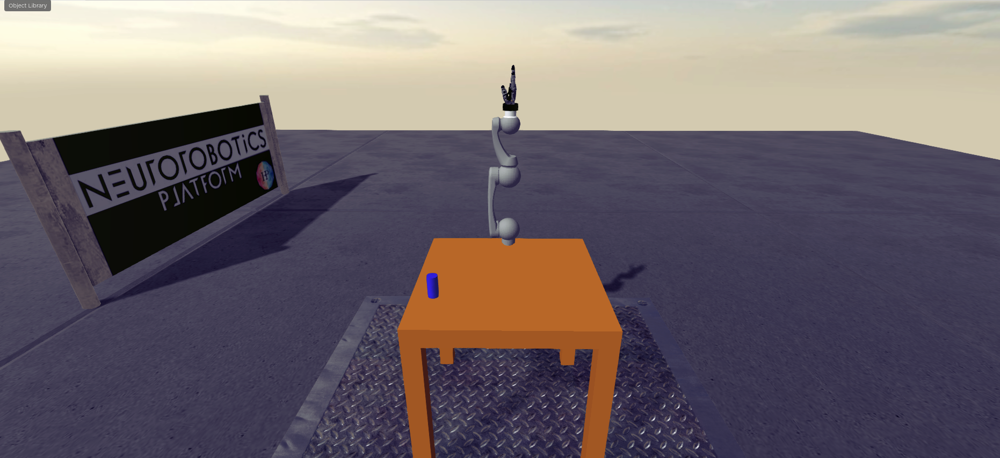

# How To: Run multiple Workers
## Step 1: Run usual NRP installer script
> ./nrp_installer install

It should install the nrp container on 172.19.0.3:8080 and the frontend on 172.19.0.2:9000.

Macs might be different!
## Step 2: Run custom NRP installer script
> ./custom_nrp_installer install

This will set-up a second nrp container

The container is called nrp2 and will run on 172.19.0.4:8080


Edit the script for every additional container you want to run:

    Go into the script and search & replace *all* "nrp2" instances to "nrp3". Repeat this process for additional containers (e.g. "nrp3" -> "nrp4" and so on).
    You will also need to edit the IP assigned to the container. Do this in line 277 of the script.
**Note**: The frontend is placed on 172.19.0.2 and the standard nrp backend container is on 172.19.0.3 so dont use these IPs.

If you use 5 containers (nrp, nrp2, nrp3, nrp4, nrp5) you can use the start_stop_container.sh script to restart them. Useful after machine reboots or similar.

Take note of all the IPs you assigned to the containers.
## Step 3: Edit the frontend for service discovery
Now attach to the frontend container (e.g. in Visual studio code or) with 
> docker exec -it frontend bash

Then find the file located in /home/bbpnrsoa/nrp/src/nrpBackendProxy/config.json and edit the "servers" object, so that the discovery service can find your backends.
For me, it looks something like this: 

>"servers": {
    "172.19.0.3": {
      "gzweb": {
        "assets": "http://172.19.0.3:8080/assets",
        "nrp-services": "http://172.19.0.3:8080",
        "videoStreaming": "http://172.19.0.3:8080/webstream/",
        "websocket": "ws://172.19.0.3:8080/gzbridge"
      },
      "rosbridge": {
        "websocket": "ws://172.19.0.3:8080/rosbridge"
      },
      "serverJobLocation": "local"
    },
    "172.19.0.4": {
      "gzweb": {
        "assets": "http://172.19.0.4:8080/assets",
        "nrp-services": "http://172.19.0.4:8080",
        "videoStreaming": "http://172.19.0.4:8080/webstream/",
        "websocket": "ws://172.19.0.4:8080/gzbridge"
      },
      "rosbridge": {
        "websocket": "ws://172.19.0.4:8080/rosbridge"
      },
      "serverJobLocation": "local"
    },
    "172.19.0.5": {
      "gzweb": {
        "assets": "http://172.19.0.5:8080/assets",
        "nrp-services": "http://172.19.0.5:8080",
        "videoStreaming": "http://172.19.0.5:8080/webstream/",
        "websocket": "ws://172.19.0.5:8080/gzbridge"
      },
      "rosbridge": {
        "websocket": "ws://172.19.0.5:8080/rosbridge"
      },
      "serverJobLocation": "local"
    },
    "172.19.0.6": {
      "gzweb": {
        "assets": "http://172.19.0.6:8080/assets",
        "nrp-services": "http://172.19.0.6:8080",
        "videoStreaming": "http://172.19.0.6:8080/webstream/",
        "websocket": "ws://172.19.0.6:8080/gzbridge"
      },
      "rosbridge": {
        "websocket": "ws://172.19.0.6:8080/rosbridge"
      },
      "serverJobLocation": "local"
    },
    "172.19.0.7": {
      "gzweb": {
        "assets": "http://172.19.0.7:8080/assets",
        "nrp-services": "http://172.19.0.7:8080",
        "videoStreaming": "http://172.19.0.7:8080/webstream/",
        "websocket": "ws://172.19.0.7:8080/gzbridge"
      },
      "rosbridge": {
        "websocket": "ws://172.19.0.7:8080/rosbridge"
      },
      "serverJobLocation": "local"
    }
}

Now, the container should be active and running (might have to restart the frontend).
You can check if all services are discovered correctly by entering one of the backend containers
> docker exec -it nrp bash

> cle-virtual-coach python

> from hbp_nrp_virtual_coach.virtual_coach import VirtualCoach

> vc = VirtualCoach(environment='local', storage_username='nrpuser', storage_password='password')

> vc.print_available_servers()

## Step 4: Setup the experiments in all containers
Use the run_exp.sh script to download requirements and the project for **each** container.

> docker exec -i nrp bash < ~/Desktop/run_exp.sh && docker exec -it nrp bash

This command will also enter the console of the container, where you will then have to install the experiment on local storage.

> cd ~/distributed_rl_worker

> python cle-virtual-coach start_experiment.py

You can then run the worker as usually 
> python Worker_v1.py


# Distributed Reinforcement Learning Agent

## Installing packages with pip

After initializing your backend container, enter the container, copy the repository and install the required packages:

```bash
docker cp . nrp:/home/bbpnrsoa/distributed-reinforcement-learning 
docker exec -it nrp bash
cd /home/bbpnrsoa/distributed-reinforcement-learning
pip install -r requirements.txt --no-cache-dir
```
**Note**: If you run the learner locally, you also have to install the packages in your local environment. (Check if you run Python 2.7. on your local machine, not Python3!) 

## Socket Inits:
Configure your IPs! 
The IP in `SERdemo1Learner/Learner_v1` is the Server-IP and must be the same as IP in `SERdemo1/Worker_v1`. 

Either work inside the Docker-Container and use localhost 127.0.0.1
Or have Worker inside the container and attach the Learner to the Docker-Host. Use 
```bash
docker network inspect nrpnet
```
 to find out the IP of your Docker-Host (e.g 172.19.0.1).


## Import experiment files
To load the experiment in your installation of the NRP (either local or source install), open the
NRP frontend in your browser at location http://host.docker.internal:9000/#/esv-private, and then navigate to the 'My experiments' tab. There, click on the 'Import folder'
button, and select the `SERdemo1/experiment/ser_rl_ss20` folder to upload. After that, the experiment should
appear under 'My experiments', and you should be able to launch it.


## Start Reinforcement Learning:
1. Start Learner either in the container:
```bash
docker exec -it nrp bash
cd /home/bbpnrsoa/distributed-reinforcement-learning
python SERdemo1Learner/Learner_v1.py
```
or start the learner locally:
```bash
python SERdemo1Learner/Learner_v1.py
```
You should see
```bash
('listening on', ('your IP address', 65432))
```
in your console now.

2. Launch the experiment in the NRP frontend. Once the simulation has started, click the play button at the top left to start the robot.

3. Start another bash window, access the container and start the Worker in the container:
```bash
docker exec -it nrp bash
cd /home/bbpnrsoa/distributed-reinforcement-learning
python SERdemo1/Worker_v1.py
```
After the robot inital commands you should see
```bash
('starting connection to', ('your IP address', 65432))
```
in your worker terminal and 
```bash
('accepted connection from', ('your IP address', 34928))
```
in your learner terminal.
## Experiment Setup
The environment consists of one Hollie Robot arm with six Degrees of Freedom, sitting on a table. A
Schunk hand is mounted on the arm, but it is of little relevance to the task to be solved. There is
also one blue cylinder on the table.



The task is for the arm to move towards the cylinder and knock it off the table. The observations at
each time step are: 
* The current joint positions (six dimensional)
* The current object pose (position and orientation) (seven dimensional)

and the actions to be taken are:
* The six joint positions

A position controller takes care of moving the joints to the desired positions.

# Besides reinforcement learning 

## Interacting with the Simulation
After launching the experiment and clicking on the play button, you can interact with the simulation
from a python shell though the Agent class in 'experiment_api.py'. It is better to do this within
the docker container, because you might need to install additional dependencies if you want to run 
it on your system. Below are the steps for interacting with the simulation from within the docker 
container:

0. Move to the experiment folder
```
$ cd SERdemo1/experiment/ser_rl_ss20
```

1. Copy the experiment_api.py file to the backend container:
```
$ docker cp experiment_api.py nrp:/home/bbpnrsoa/
```

2. Access the backend docker container:
```
$ docker exec -it nrp bash
```

3. Open a python shell inside the backend container and import the experiment api:
```
$ cd ~

$ python

>>> import experiment_api
```

4. Instantiate the agent class and explore the available functions:
```
>>> agent = experiment_api.Agent()
>>> agent.get_current_state()
>>> agent.act(1, 1, 1, 1, 1, 1)
>>> agent.reset()
```

Feel free to extend the experiment_api.py with functions that you see necessary.
